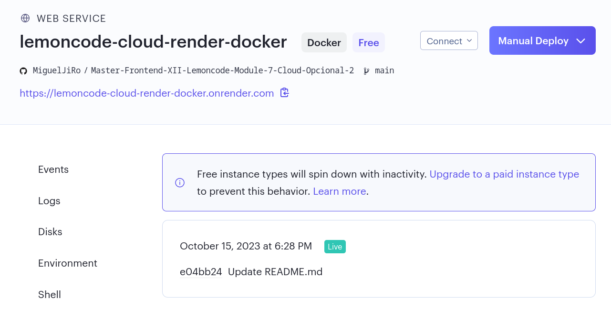
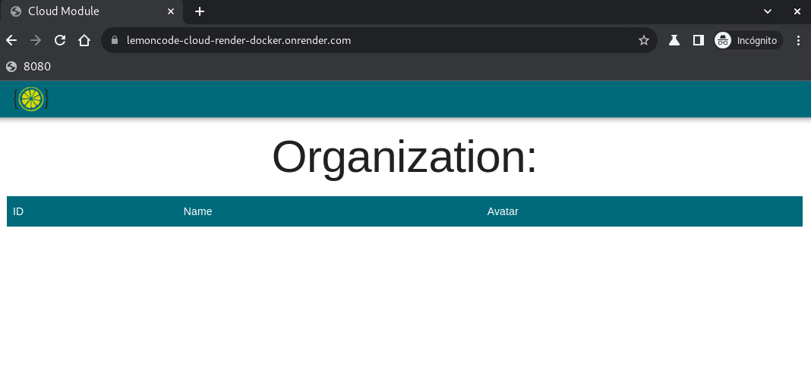

# Master Frontend XII Lemoncode 🍋

## Module 7 CLOUD

### opcional parte 2

 

[Go back - Index](https://github.com/MiguelJiRo/Master-Frontend-XII-Lemoncode)

 

 

### Parte opcional - 2

<ol>
    <li>❌ Desplegar aplicación front de forma automática + Docker en Heroku. (ya no hay dynos gratuitos)</li>
    <li>✅ Desplegar la página en Render + Docker.</li>
</ol>

Para el desarrollo de esta parte se ha seguido el ejemplo de: https://github.com/Lemoncode/master-frontend-lemoncode/tree/master/07-cloud/03-docker/04-auto-render-deploy

 

https://lemoncode-cloud-render-docker.onrender.com

 

